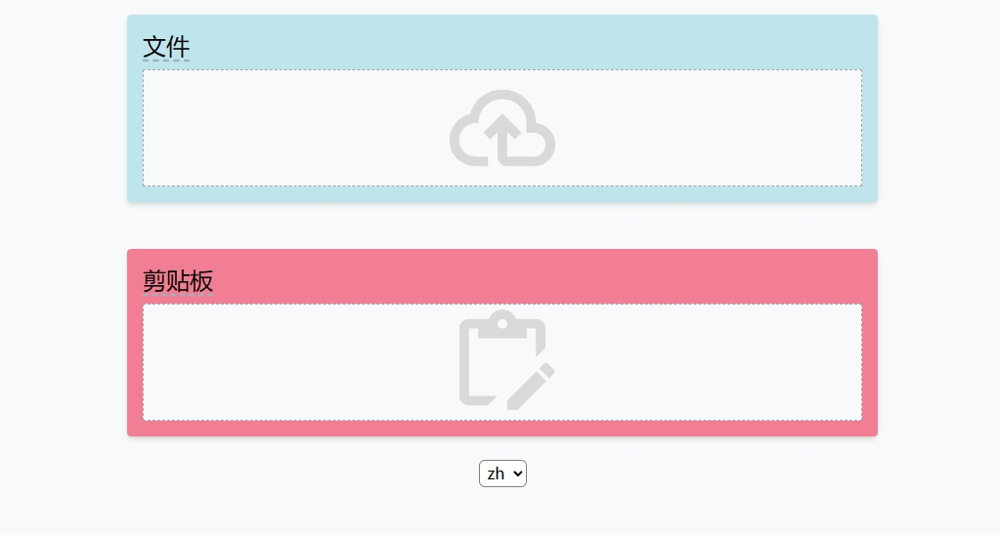
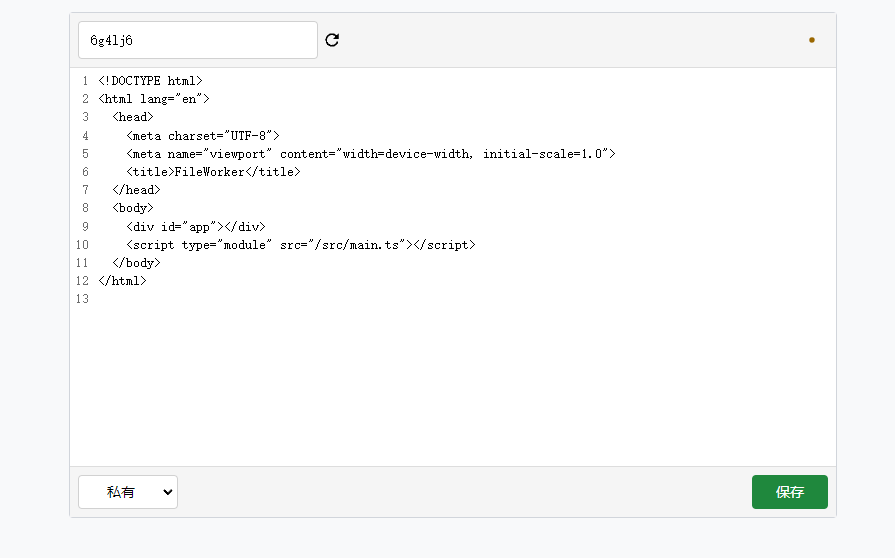
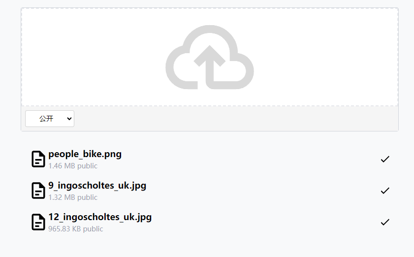
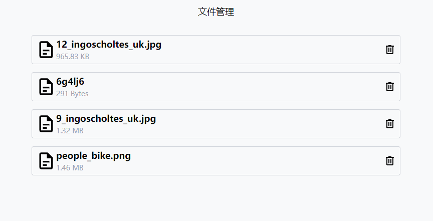

<h1 align="center">FileWorker</h1>

FileWorker 是一个轻量级的文件管理和在线剪贴板，基于 Cloudflare Pages 和 R2。

## ✏️部署

更新无需重新部署，在 fork 的仓库里同步上游即可，cloudflare 会自动更新。

1. Fork 本仓库
2. 部署 Pages

   Cloudflare DashBoard -> Workers & Pages -> Create application -> Pages ->

   Connect to Git -> 选择 Fork 的仓库 ->

   设置 `Build command`: `npm run build`

   设置 `Build output directory`: `dist`

   点击 `Save and Deploy`

3. 创建 R2 存储桶

   Cloudflare DashBoard -> R2 -> Create Bucket

4. 获取 R2 存储桶的信息

   Cloudflare DashBoard -> R2 -> Manage R2 API Tokens -> Create API token

   选择 Object Read & Write 或者 Admin Read & Write。

   创建后记录 `Access Key ID`、`Secret Access Key`。
   以及存储桶的`Endpoint`（格式为：`https://{account_id}.r2.cloudflarestorage.com`）

   这些信息不会再次显示。

5. 设置环境变量

   Cloudflare DashBoard -> {Your Worker} -> Settings -> Environment Variables -> (Production)Add variables

   添加以下环境变量：

   1. S3 地区，对于 R2 存储桶可以直接设置为 `auto`

      > REGION=auto

   2. 存储桶名称

      > BUCKET=store

   3. 存储桶的 Endpoint

      > ENDPOINT=https://{account_id}.r2.cloudflarestorage.com

   4. Access Key ID

      > ACCESS_KEY_ID=31415926535897932384626433832795

   5. Secret Access Key

      > SECRET_ACCESS_KEY=3141592653589793238462643383279502884197169399375105820974944592

   6. 访问密码（自己设置）
      > PASSWORD=123456

6. 重新部署

   Cloudflare DashBoard -> {Your Worker} -> Deployments -> All deployments -> Retry deployment

## 💡使用

